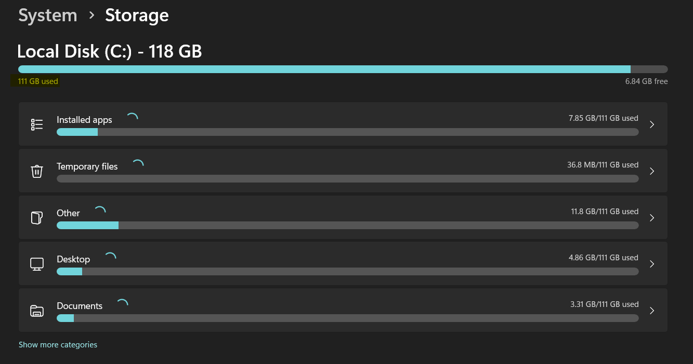

# Titanic Survival Interactive Dashboard

This Streamlit app provides an interactive dashboard to explore survival patterns in the Titanic dataset. You can dynamically select different categorical and numeric variables to visualize survival trends and correlations.

## 🔍 Features
- Bar plots of survival statistics by class, sex, and more
- Optional hue (grouping) selector for deeper analysis
- Sidebar filters for interactive variable selection
- Data preview toggle

## 📊 Dataset
The dataset is loaded directly from Seaborn's public repository:
- Source: [`seaborn-data`](https://github.com/mwaskom/seaborn-data)
- Dataset: `titanic.csv`

## 🚀 How to Run Locally
1. Clone this repository:
   ```bash
   git clone https://github.com/yourusername/titanic-dashboard.git
   cd titanic-dashboard
   ```
2. Install dependencies:
   ```bash
   pip install -r requirements.txt
   ```
3. Run the app:
   ```bash
   streamlit run titanic_streamlit_dashboard.py
   ```

## 🌐 How to Deploy on Streamlit Cloud
1. Push your code and `requirements.txt` to GitHub
2. Go to [Streamlit Cloud](https://share.streamlit.io)
3. Connect your GitHub and deploy the repo

## 📝 Requirements
```
streamlit
pandas
matplotlib
seaborn
```

## ✨ Screenshot

---

## 📬 Contact
For questions or improvements, please open an issue or fork the repo. Happy exploring!
